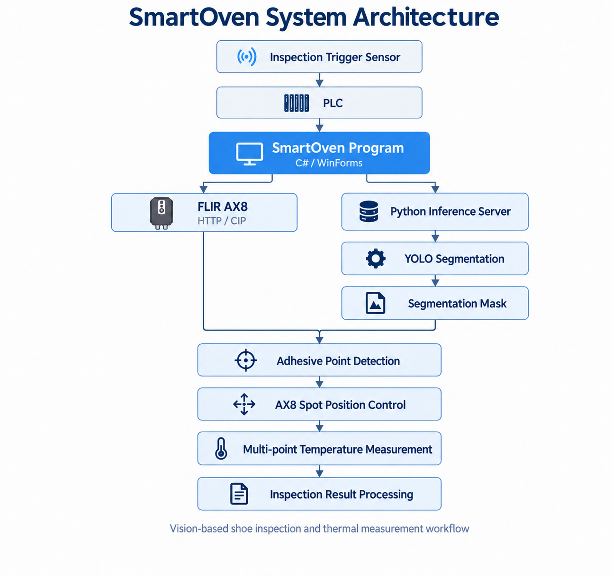
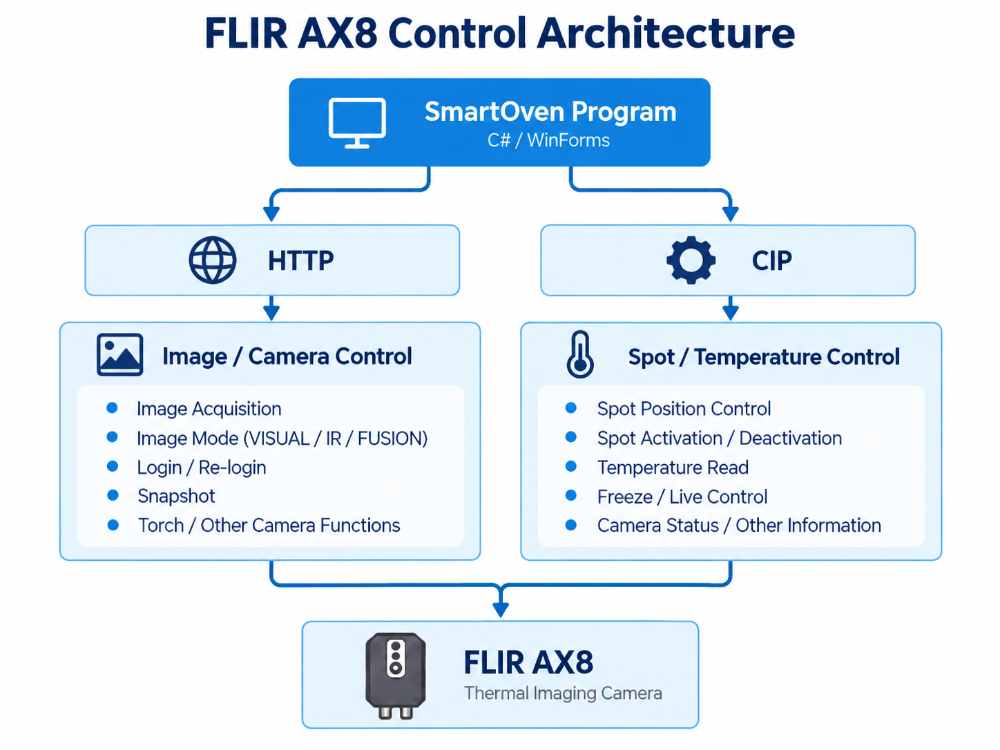

## 1. Project Overview

MAS SmartOven은 신발 제조 공정에서 접착 공정에 필요한 온도 상태를 자동으로 검사하기 위해 개발된 Vision 및 열화상 기반 검사 시스템입니다.

컨베이어를 따라 이동하는 신발을 Camera 영상에서 **YOLO 기반 객체 검출**을 통해 인식하고, 검출된 신발 영역을 기반으로 **PCA(Principal Component Analysis)를 활용하여 신발의 형상 및 방향을 분석하고 여러 접착 포인트의 위치를 추정**합니다.

이후 추정된 각 접착 포인트에 FLIR AX8 열화상 카메라의 측정 Spot을 배치하여 여러 위치의 온도를 측정하고, 이를 통해 접착 공정에 필요한 온도 상태를 검사하도록 구성하였습니다.

전체 검사 과정은 다음과 같습니다.

```text
Conveyor 위 신발 이동
        ↓
Camera Image 획득
        ↓
YOLO 기반 신발 객체 검출
        ↓
PCA 기반 신발 방향 및 형상 분석
        ↓
복수의 접착 포인트 위치 추정
        ↓
FLIR AX8 Spot 위치 설정
        ↓
각 접착 포인트 온도 측정
        ↓
접착 공정 온도 상태 검사
```

본 시스템은 실제 신발 제조 공정 현장에 적용되어 운용되고 있으며, Vision 기반 객체 검출 및 위치 추정과 FLIR AX8 열화상 카메라를 연동하여 컨베이어를 따라 이동하는 신발의 여러 접착 포인트 온도를 자동으로 측정하도록 구성되어 있습니다.

| **항목**  | **내용**                                           |
| ------- | ------------------------------------------------ |
| 프로젝트    | MAS SmartOven                                    |
| 개발 대상   | 신발 접착 공정 온도 검사 시스템                               |
| 주요 기능   | YOLO 기반 신발 검출, PCA 기반 접착 포인트 위치 추정, 복수 포인트 온도 측정 |
| 열화상 카메라 | FLIR AX8                                         |
| 적용 환경   | 실제 신발 제조 공정                                      |
| 주요 기술   | Vision, YOLO, PCA, Thermal Imaging               |

## 2. My Role

MAS SmartOven 프로젝트에서 **FLIR AX8 열화상 카메라의 통신 및 제어 프로그램 개발**을 담당하였습니다.

SmartOven 시스템에서 사용할 FLIR AX8의 영상 및 온도 정보를 확인하고, 복수의 측정 Spot을 제어할 수 있도록 **C# WinForms 기반 제어 프로그램**을 구현하였습니다.

주요 담당 업무는 다음과 같습니다.

* FLIR AX8 열화상 카메라 제어 프로그램 개발
* HTTP 기반 카메라 로그인 및 이미지 획득 기능 구현
* VISUAL / IR / FUSION 영상 모드 제어
* EtherNet/IP(CIP) 기반 FLIR AX8 장치 통신 구현
* 복수의 온도 측정 Spot 활성화 및 위치 제어
* Spot별 온도 및 카메라 내부 온도 측정 기능 구현
* 측정 Spot 상태 및 온도 정보를 열화상 영상 위에 시각화
* Mouse Drag & Drop을 이용한 Spot 위치 변경 기능 구현
* Snapshot, Freeze, Torch 등 FLIR AX8 기능 제어
* 주기적인 온도 측정 및 HTTP 세션 재로그인 처리
* 실제 SmartOven 적용 환경을 고려한 FLIR AX8 연동 및 장비 동작 검증

본 Repository에는 프로젝트에서 제가 담당한 **FLIR AX8 제어 프로그램 관련 소스 코드**를 중심으로 공개하였습니다.

## 3. Demo

### 3.1 FLIR AX8 Control Program

C# WinForms 기반으로 개발한 FLIR AX8 제어 프로그램을 이용하여 열화상 영상 확인, 온도 측정 Spot 제어 및 카메라 기능 제어를 테스트하였습니다.

주요 시연 내용은 다음과 같습니다.

* FLIR AX8 연결 및 열화상 영상 확인
* VISUAL / IR / FUSION 영상 모드 변경
* 복수의 온도 측정 Spot 활성화 및 위치 제어
* Spot별 실시간 온도 확인
* 열화상 영상 위 Spot 위치 및 온도 정보 표시
* Mouse Drag & Drop을 이용한 Spot 위치 변경
* Freeze / Snapshot / Torch 기능 제어

[](https://youtu.be/pT65LI4sWbg)

▶ [FLIR AX8 Control Program Demo](https://youtu.be/pT65LI4sWbg)
---

### 3.2 SmartOven System Operation

본 프로그램에서 구현하고 검증한 FLIR AX8 제어 기능은 이후 MAS SmartOven 시스템 개발 과정에서 활용되어 전체 시스템 구조와 UI에 맞게 재구성되었으며, 실제 신발 제조 공정 환경에 적용되어 운용되고 있습니다.

SmartOven 시스템은 컨베이어를 따라 이동하는 신발을 Vision 기반으로 검출하고, 신발의 방향과 위치를 분석하여 여러 접착 포인트의 위치를 추정합니다. 이후 FLIR AX8의 측정 Spot을 해당 위치에 설정하여 각 접착 포인트의 온도를 측정합니다.

실제 적용 환경에서는 다음과 같은 전체 검사 과정을 확인할 수 있습니다.

```text
신발 투입
    ↓
Conveyor 이동
    ↓
Vision 기반 신발 검출
    ↓
접착 포인트 위치 추정
    ↓
FLIR AX8 Spot 설정
    ↓
복수 포인트 온도 측정
    ↓
접착 공정 온도 상태 확인
```

[](https://youtu.be/_87dW1RamdI)

▶ [SmartOven System Operation Demo](https://youtu.be/_87dW1RamdI)

## 4. Tech Stack

### FLIR AX8 Control Program

| **Category**            | **Technologies**              |
| ----------------------- | ----------------------------- |
| Language                | C#                            |
| Framework / UI          | .NET Framework, Windows Forms |
| Thermal Camera          | FLIR AX8                      |
| Communication           | HTTP, EtherNet/IP (CIP)       |
| EtherNet/IP Library     | Sres.Net.EEIP                 |
| Data Processing         | Newtonsoft.Json               |
| Development Environment | Visual Studio                 |

FLIR AX8 제어 프로그램에서는 카메라 영상 및 일부 장치 기능 제어에 **HTTP**를 사용하고, 온도 측정 Spot 및 장치 상태 제어에는 **EtherNet/IP(CIP)** 통신을 사용하였습니다.

### SmartOven System

FLIR AX8 제어 프로그램이 적용된 SmartOven 전체 시스템에서는 다음 기술이 함께 사용되었습니다.

| **Category**        | **Technologies**            |
| ------------------- | --------------------------- |
| Vision / AI         | YOLO                        |
| Position Analysis   | PCA                         |
| Thermal Measurement | FLIR AX8                    |
| Application         | SmartOven Inspection System |
| Target Environment  | Shoe Manufacturing Process  |

## 5. System Architecture

SmartOven은 **PLC, Vision 추론 시스템, FLIR AX8 열화상 카메라 및 C# WinForms 기반 제어 프로그램**을 연동하여 신발 접착 공정의 온도를 검사하는 구조로 구성되어 있습니다.

시스템에는 상·하부 검사를 위한 **2대의 FLIR AX8**이 연결되어 있으며, SmartOven 프로그램에서 각 카메라와 Vision 추론 시스템을 통합하여 관리합니다.

### 5.1 SmartOven System Overview

전체 시스템의 주요 데이터 흐름은 다음과 같습니다.



SmartOven 프로그램은 PLC와 연동하여 검사 시스템의 동작 상태를 관리하고, 상·하부 FLIR AX8 및 Vision 추론 서버를 초기화하여 검사에 필요한 장치를 통합적으로 제어합니다.

Vision 시스템에서는 획득한 신발 영상을 YOLO 기반으로 처리하여 Segmentation Mask를 생성하고, 해당 결과를 기반으로 신발의 형상과 방향을 분석하여 여러 접착 포인트의 위치를 결정합니다.

결정된 위치는 FLIR AX8의 측정 Spot 위치로 사용되며, 각 Spot에서 측정된 온도를 기반으로 접착 공정의 온도 상태를 검사합니다.

### 5.2 FLIR AX8 Control Architecture

FLIR AX8 제어에는 **HTTP와 EtherNet/IP(CIP)** 두 가지 통신 방식을 사용하였습니다.



HTTP 통신은 FLIR AX8의 영상 획득과 카메라 기능 제어에 사용하고, EtherNet/IP(CIP)는 복수의 측정 Spot 위치 및 상태 제어와 온도 데이터 획득에 사용하도록 기능을 분리하였습니다.

SmartOven 프로그램 실행 시 상·하부 FLIR AX8에 각각 HTTP 및 CIP 연결을 수행하고, 카메라 영상 모드, Live 상태 및 Spot 정보를 초기화한 뒤 검사에 사용할 수 있도록 구성하였습니다.

## 6. Implementation

### 6.1 FLIR AX8 Image & Camera Control

FLIR AX8에서 제공하는 HTTP 기반 인터페이스를 이용하여 카메라 로그인과 영상 획득 기능을 구현하였습니다.

카메라에서 획득한 이미지는 WinForms의 `PictureBox`에 표시하며, 새로운 이미지를 갱신할 때 기존 Bitmap 객체를 해제하여 반복적인 영상 조회 과정에서 불필요한 리소스가 누적되지 않도록 처리하였습니다.

또한 카메라의 영상 모드를 제어하여 목적에 따라 다음 세 가지 화면을 선택할 수 있도록 구성하였습니다.

* `VISUAL` : 가시광 영상
* `IR` : 열화상 영상
* `FUSION` : 가시광 및 열화상 융합 영상

이외에도 Snapshot 저장, Torch 제어 등의 FLIR AX8 기능을 WinForms UI에서 직접 제어할 수 있도록 구현하였습니다.

---

### 6.2 Spot & Temperature Control

EtherNet/IP(CIP) 통신을 이용하여 FLIR AX8의 온도 측정 Spot을 제어하고 각 Spot의 온도 정보를 읽을 수 있도록 구현하였습니다.

FLIR AX8에서 사용하는 **Spot 1 ~ 6**의 상태를 프로그램 내부에서 관리하며, 각 Spot에 대해 활성화 여부, 위치 및 측정 온도를 확인할 수 있도록 구성하였습니다.

사용자는 UI를 통해 개별 Spot을 활성화하거나 비활성화할 수 있으며, 하나의 Spot 또는 여러 Spot의 위치를 동시에 변경할 수 있습니다.

또한 활성화된 Spot의 온도를 주기적으로 읽어 화면에 표시하고, FLIR AX8 내부 카메라 온도 역시 별도로 확인할 수 있도록 구현하였습니다.

카메라의 `Freeze / Live` 상태도 CIP를 통해 제어하여 열화상 화면을 고정하거나 실시간 상태로 전환할 수 있도록 구성하였습니다.

---

### 6.3 Spot Visualization & Drag-and-Drop Control

온도 측정 위치를 직관적으로 확인할 수 있도록 FLIR AX8 영상 위에 각 Spot의 위치와 온도 정보를 Overlay 형태로 표시하였습니다.

각 Spot은 영상 위에 Point와 Spot ID, 현재 온도를 함께 표시하며, 활성화된 Spot만 화면에 나타나도록 구성하였습니다.

또한 사용자가 영상 위에 표시된 Spot을 **Mouse Drag & Drop**으로 직접 이동할 수 있도록 구현하였습니다.

```text
Spot 선택
    ↓
Mouse Drag
    ↓
화면상의 새로운 Spot 위치 결정
    ↓
FLIR AX8 Spot 위치 변경
    ↓
변경된 위치 정보 갱신
    ↓
UI Overlay 업데이트
```

이를 통해 별도의 좌표 입력 없이 실제 열화상 화면을 보면서 원하는 온도 측정 위치를 직접 조정할 수 있도록 하였습니다.

---

### 6.4 Periodic Monitoring & Connection Management

실제 장비를 지속적으로 사용하는 환경을 고려하여 영상 및 온도 정보를 주기적으로 갱신할 수 있도록 Timer 기반 동작을 구성하였습니다.

영상 자동 갱신 기능을 활성화하면 FLIR AX8에서 새로운 이미지를 반복적으로 획득하며, 온도 자동 측정 기능을 통해 활성화된 Spot과 카메라 내부 온도를 일정 주기로 확인할 수 있습니다.

또한 HTTP 연결이 장시간 유지되는 환경에서 세션 상태를 관리하기 위해 주기적인 Re-login 기능을 적용하였습니다.

장비 연결 및 제어 과정에서는 비동기 처리를 사용하여 HTTP 및 CIP 통신 중 WinForms UI가 장시간 멈추지 않도록 구성하였으며, 통신 실패 시 UI 상태를 복구하거나 오류 상태를 표시하도록 처리하였습니다.

## 7. Repository Structure

본 Repository는 MAS SmartOven 프로젝트를 위해 개발한 **FLIR AX8 열화상 카메라 통신 및 제어 기능 검증 프로그램**의 주요 소스 코드로 구성되어 있습니다.

본 프로그램에서 구현한 FLIR AX8 제어 기능은 이후 실제 MAS SmartOven 시스템에 통합되는 과정에서 전체 프로그램 구조와 UI 구성에 맞게 재구성되었습니다.

장비 통신의 세부 구현이 포함된 일부 코드 파일은 공개 범위에서 제외하였습니다.

```text
MAS_SmartOven-FLIR-AX8-Control/
├── README.md
├── .gitignore
├── HB_FLiRCap.sln
│
├── docs/
│   ├── smartoven_system_architecture.png
│   └── flir_ax8_control_architecture.png
│
└── HB_FLiRCap/
    ├── App.config
    ├── Ax8CIPProp.cs              [Excluded from public repository]
    ├── Ax8HttpImage.cs            [Excluded from public repository]
    ├── FrmMain.cs
    ├── FrmMain.Designer.cs
    ├── FrmMain.resx
    ├── Globl.cs
    ├── HB_FLiRCap.csproj
    ├── packages.config
    ├── Program.cs
    │
    └── Properties/
        ├── AssemblyInfo.cs
        ├── Resources.Designer.cs
        ├── Resources.resx
        ├── Settings.Designer.cs
        └── Settings.settings
```

## 8. Repository Notes

본 Repository는 MAS SmartOven 프로젝트를 위해 개발한 **FLIR AX8 열화상 카메라 통신 및 제어 기능 검증 프로그램**을 포트폴리오 목적으로 정리한 공개 Repository입니다.

장비 통신의 세부 구현이 포함된 다음 소스 코드는 공개 범위에서 제외하였습니다.

- `Ax8CIPProp.cs`
- `Ax8HttpImage.cs`

또한 FLIR AX8 제조사에서 제공한 Firmware 및 관련 파일은 본 Repository에 포함하지 않았습니다.

따라서 본 Repository는 전체 프로그램을 그대로 빌드 및 실행하기 위한 배포용 프로젝트가 아니라, **FLIR AX8 제어 프로그램에서 구현한 기능과 소프트웨어 구성 및 개발 내용을 확인하기 위한 목적**으로 공개하였습니다.

본 프로그램에서 구현하고 검증한 HTTP 및 EtherNet/IP(CIP) 기반 FLIR AX8 제어 기능은 이후 MAS SmartOven 시스템 개발 과정에서 참고 및 활용되었으며, 실제 시스템에서는 전체 프로그램 구조와 UI 구성에 맞게 재구성하여 통합되었습니다. 해당 SmartOven 시스템은 실제 신발 제조 공정 현장에 적용되어 운용되고 있습니다.

실제 동작 결과와 적용 환경은 상단의 [Demo](#3-demo) 영상을 통해 확인할 수 있습니다.

## 9. Project Result

본 프로젝트를 통해 FLIR AX8 열화상 카메라의 영상 획득과 온도 측정 기능을 하나의 C# WinForms 프로그램에서 제어할 수 있도록 구현하고, 실제 SmartOven 시스템에 필요한 주요 카메라 제어 기능을 검증하였습니다.

구현 및 검증한 FLIR AX8 제어 기능은 이후 실제 MAS SmartOven 시스템 개발에 활용되었으며, 전체 프로그램 구조와 UI에 맞게 재구성되어 현재 실제 신발 제조 공정의 온도 검사 시스템에 적용되어 운용되고 있습니다.

주요 결과는 다음과 같습니다.

- HTTP 기반 FLIR AX8 영상 획득 및 카메라 기능 제어 구현
- EtherNet/IP(CIP) 기반 복수 Spot 위치 제어 및 온도 측정 기능 구현
- Spot 활성화 상태, 위치 및 온도 정보를 실시간으로 확인할 수 있는 UI 구현
- 열화상 영상 위 Spot 위치 및 온도 정보 Overlay 기능 구현
- Mouse Drag & Drop 기반 Spot 위치 제어 기능 구현
- 주기적인 영상 및 온도 모니터링과 HTTP Re-login 기능 구현
- 실제 FLIR AX8 장비를 이용한 통신 및 제어 기능 검증
- 구현한 FLIR AX8 제어 기능을 실제 MAS SmartOven 시스템 개발 과정에서 참고 및 활용
- 전체 SmartOven 프로그램 구조와 UI에 맞게 재구성되어 실제 신발 제조 공정의 온도 검사 시스템에 통합 및 현장 운용
